# Spendoza

Personal and household finance tracker with AI-powered bank statement processing, automatic bill detection, goal tracking, and financial insights.

## Overview

Spendoza helps individuals and households take control of their finances. Upload a bank statement PDF and the AI pipeline extracts transactions, classifies them into your categories, detects recurring bills, and matches them against existing records. Set budget and savings goals, track progress over time, and get AI-generated insights in monthly reports.

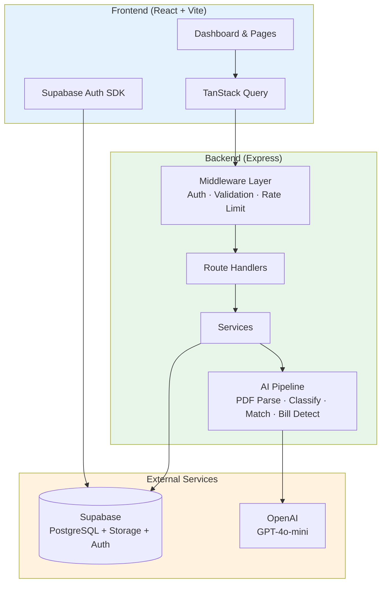

## Tech Stack

| Layer | Technology |
|-------|-----------|
| **Runtime** | Bun |
| **Backend** | Express (TypeScript) |
| **Frontend** | React 19, Vite 7 |
| **UI** | shadcn/ui, Tailwind CSS 4, Radix UI |
| **Charts** | Recharts |
| **Data Fetching** | TanStack Query |
| **Validation** | Zod (shared schemas) |
| **AI** | LangChain + OpenAI (GPT-4o-mini) |
| **Database** | Supabase (PostgreSQL + Auth + Storage) |
| **Build** | Turborepo |
| **Deployment** | Vercel |

## Monorepo Structure

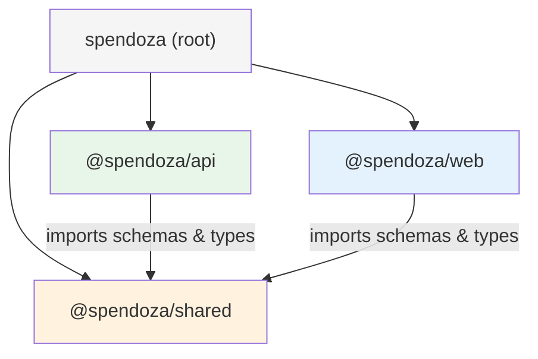

```
spendoza/
├── package.json              # Root workspace config
├── turbo.json                # Turborepo task pipeline
├── CLAUDE.md                 # AI assistant instructions
├── .github/workflows/        # CI/CD (PR checks, test deploy, prod deploy)
└── packages/
    ├── shared/               # Zod schemas, types, constants
    │   └── src/schemas/      # 9 schema modules
    ├── api/                  # Express backend
    │   └── src/
    │       ├── routes/       # 10 route modules
    │       ├── services/     # Business logic (reports, bill detection)
    │       ├── ai/           # AI pipeline modules
    │       ├── middleware/    # Auth, validation, error handling
    │       └── lib/          # Supabase client
    └── web/                  # React frontend
        └── src/
            ├── pages/        # 10 page components
            ├── components/   # Feature & UI components
            ├── hooks/        # TanStack Query hooks
            ├── contexts/     # Auth context provider
            └── lib/          # API client, Supabase, utilities
```

## Key Features

### Bank Statement AI Pipeline

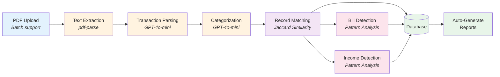

Upload one or more bank statement PDFs (batch upload with drag-and-drop support) and the pipeline:
1. Extracts raw text from the PDF
2. Uses GPT-4o-mini to identify individual transactions (with auto-detected bank name and statement month)
3. Classifies each transaction into user-defined categories
4. Matches transactions to existing expenses/income records using string similarity and amount proximity
5. Detects recurring bill patterns and creates auto-tracked expenses
6. Detects recurring income sources and creates auto-tracked income entries
7. Auto-generates monthly reports for all months with transaction data
8. Retries failed steps with exponential backoff for resilient processing

Your bank statement is deleted after processing -- only extracted transaction data is stored, never the original file.

### Automatic Bill Detection

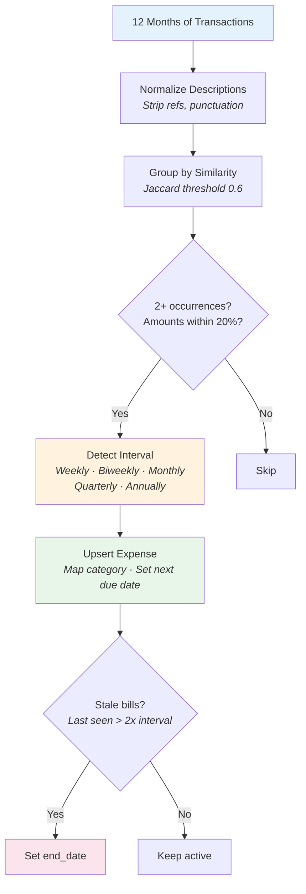

After each bank statement upload, the system analyzes all user transactions to:
- Group similar transaction descriptions (e.g., "NETFLIX COM 12345" and "NETFLIX COM 67890")
- Detect recurring patterns with configurable tolerance for amount variation (20%)
- Automatically create or update tracked bills with projected next due dates
- Expire bills that stop appearing (staleness threshold: 2x the billing interval)
- Re-activate previously expired bills when the pattern reappears
- Never modify manually-created expenses

Auto-detected bills appear in the Upcoming Bills dashboard widget and Expenses page with an "Auto" badge. AI-generated friendly names (e.g., "Netflix" instead of "NETFLIX COM 12345") are displayed throughout the UI and PDF exports.

### Automatic Income Detection

The same pattern analysis runs for income transactions:
- Groups similar credit transactions across months
- Detects recurring income patterns (payroll, freelance payments, etc.)
- Creates auto-tracked income entries with friendly names
- Attributes income to household members when applicable

### Financial Goals

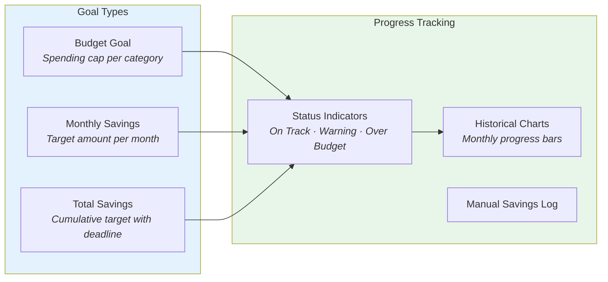

- **Budget goals** -- Set spending caps per category and track actual vs. target
- **Monthly savings targets** -- Define how much to save each month
- **Total savings goals** -- Set a cumulative target with an optional deadline
- Progress bars with color-coded status indicators
- Historical charts showing month-by-month performance

### Household Finance Sharing

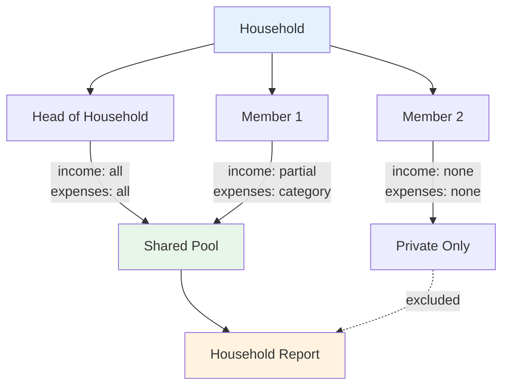

- Create or join a household via invite code
- Each member configures sharing preferences (all, none, partial/category)
- Household dashboard shows aggregate finances and member contributions
- Household reports aggregate shared data only
- Head of household manages invitations and member removal (max 10 members)
- Ownership transfer -- head of household can transfer control to another member
- Members can leave a household (ownership auto-transfers if head leaves)
- Income attribution -- track income from non-household sources with custom names (e.g., roommate contributions)

### AI-Powered Reports

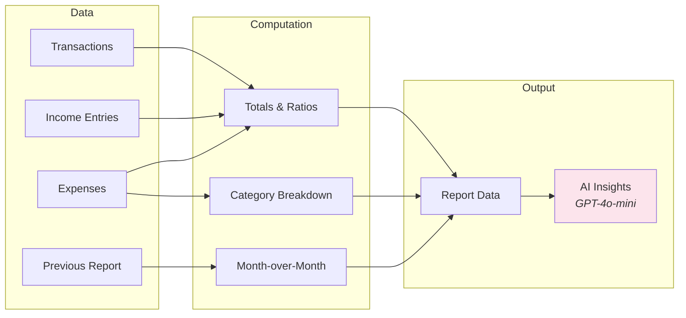

- Personal and household monthly reports
- Savings rate, expense-to-income ratio, category breakdowns
- Month-over-month trend comparison
- AI-generated bullet-point financial insights
- Auto-generated after bank statement processing and during onboarding
- Rate limited to 2 manual refreshes per 24 hours in production; automated via cron

### PDF Export

Download comprehensive PDF reports from both personal and household dashboards:

| Section | Contents |
|---------|----------|
| **Financial Summary** | Total income, expenses, net, savings rate |
| **Month-over-Month Trends** | Income and expense percentage changes |
| **AI Insights** | AI-generated bullet-point financial analysis |
| **Expense Breakdown** | Category-by-category spending table with percentages |
| **Recurring Bills** | All tracked bills with amounts, frequency, and next due dates |
| **Income Sources** | All income entries with frequency and household attribution |
| **Subscriptions Paid** | Active recurring expenses for the month with total cost and % of expenses |
| **Goal Progress** | Visual progress bars for each goal with on-track/behind status |
| **Savings Opportunities** | Data-driven recommendations for high-spend categories, subscription burden, and savings rate gaps |
| **Member Contributions** | Per-member income and expense totals (household reports only) |

### Dashboard

The personal dashboard provides an at-a-glance financial overview with a global time period filter that persists across navigation:

| Widget | Description |
|--------|-------------|
| **Summary Cards** | Total income, expenses, savings rate, net position |
| **Income vs Expenses** | Bar chart comparing monthly totals |
| **Spending by Category** | Donut chart with category breakdown |
| **Top Expenses** | Horizontal bar chart of highest spending categories |
| **Upcoming Bills** | Recurring bills with due dates and auto-detection badges |
| **AI Insights** | Personalized financial observations from GPT-4o-mini |
| **Export PDF** | Download a comprehensive monthly report as PDF |

### Global Time Period Filter

A persistent time period filter is available across dashboards, transactions, income, and expenses pages:
- Presets: This Month, Last Month, Last 3 Months, This Year, Last Year, All Time
- Specific month selection via `month:YYYY-MM` format
- Smart auto-detection defaults to the most recent month with data
- Filter state persists in the URL across page navigation

### Guided Onboarding

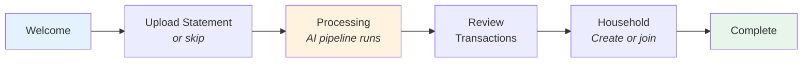

New users are guided through a multi-step onboarding flow:
1. Welcome introduction
2. Bank statement upload (skippable)
3. AI processing with real-time progress
4. Review parsed and categorized transactions
5. Create or join a household (optional)
6. Setup complete

### Additional Features

- **Dark mode** -- System, light, and dark themes with full chart support
- **Profile management** -- Avatar upload, display name editing
- **Transaction browser** -- Filter by type, time period, and description search with global time period context
- **Category management** -- Create, edit, delete, and share categories with household
- **Batch bank statement upload** -- Drag-and-drop multiple PDFs with per-file status tracking and sequential processing
- **Invite code registration** -- Gated signup via invite codes (max 3 active codes per user)
- **Privacy-first design** -- Bank statements are deleted after processing; only extracted data is stored
- **Responsive design** -- Mobile-friendly layout across all pages

## Getting Started

### Prerequisites

- [Bun](https://bun.sh) v1.3+
- A [Supabase](https://supabase.com) project (PostgreSQL + Auth + Storage)
- An [OpenAI API key](https://platform.openai.com)

### Installation

```bash
git clone https://github.com/mjmitchell86/Spendoza.git
cd Spendoza
bun install
```

### Environment Variables

Create `.env` files in the relevant packages:

**packages/api/.env**
```env
PORT=3001
SUPABASE_URL=https://your-project.supabase.co
SUPABASE_SERVICE_ROLE_KEY=your-service-role-key
SUPABASE_ANON_KEY=your-anon-key
OPENAI_API_KEY=sk-...
CRON_SECRET=your-cron-secret
```

**packages/web/.env**
```env
VITE_SUPABASE_URL=https://your-project.supabase.co
VITE_SUPABASE_ANON_KEY=your-anon-key
```

### Development

```bash
bun run dev        # Start all packages in dev mode (Turborepo)
bun run build      # Build all packages
bun run test       # Run all tests
bun run typecheck  # Type-check all packages
bun run lint       # Lint all packages
bun run format     # Format with Prettier
```

Per-package development:

```bash
cd packages/api && bun run dev    # API server only (port 3001)
cd packages/web && bun run dev    # Vite dev server only (port 5173)
```

Seed a test user with 6 months of realistic mock bank data:

```bash
cd packages/api && bun run seed   # Creates test user with transactions from 3 banks
```

## API Endpoints

| Group | Base Path | Auth | Endpoints |
|-------|-----------|------|-----------|
| Auth | `/api/auth` | Public | signup, login, logout |
| Profile | `/api/profile` | Required | get, update, complete onboarding, upload avatar |
| Categories | `/api/categories` | Required | CRUD |
| Income | `/api/income` | Required | CRUD |
| Expenses | `/api/expenses` | Required | CRUD (auto-filters expired bills) |
| Bank Statements | `/api/bank-statements` | Required | upload, list, get detail, reprocess |
| Transactions | `/api/transactions` | Required | list, update, attribute, bulk-attribute |
| Households | `/api/households` | Required | create, get, invite, join, remove, sharing, transfer ownership, leave |
| Reports | `/api/reports` | Mixed | personal, household, generate, generate-all (cron), export/personal (PDF), export/household (PDF) |
| Dashboard | `/api/dashboard` | Required | personal summary, household summary |
| Goals | `/api/goals` | Required | CRUD, progress tracking, log savings |
| Invite Codes | `/api/invite-codes` | Required | create, list, delete (max 3 active per user) |

## Database Schema

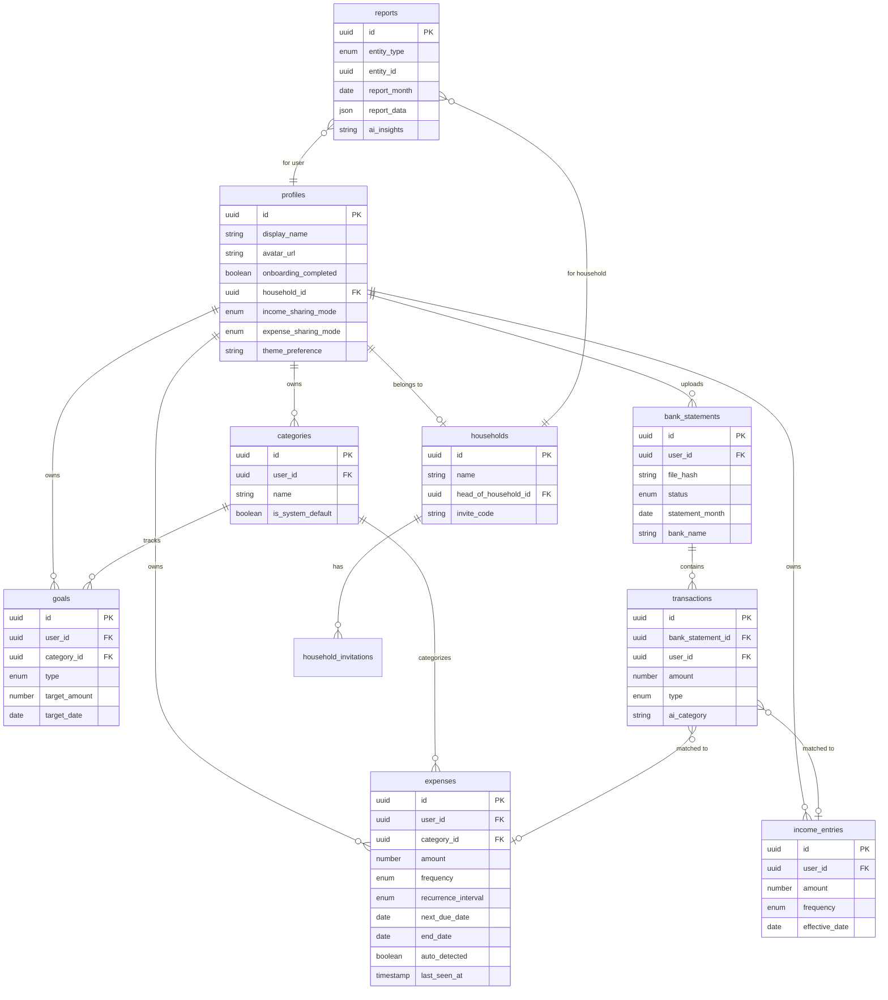

## CI/CD

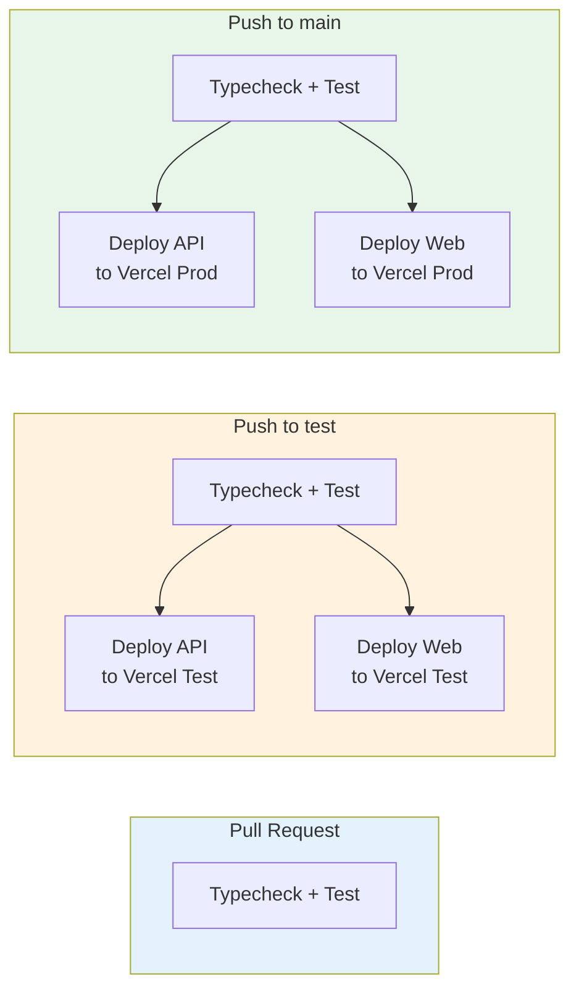

Three GitHub Actions workflows:
- **PR Check** -- Runs typecheck + test on every pull request
- **Test Deploy** -- On push to `test` branch: checks then deploys both packages to Vercel test environment
- **Prod Deploy** -- On push to `main` branch: checks then deploys to Vercel production

## Git Workflow

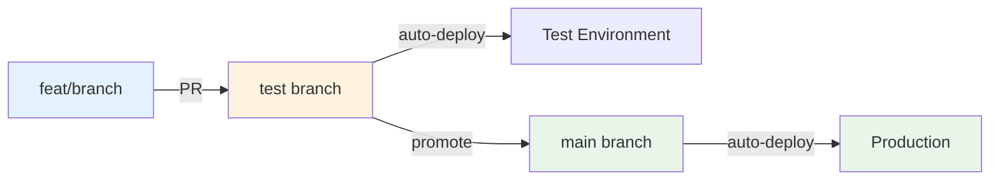

1. Create a feature branch from `test`
2. Develop and test locally
3. Push and open a PR against `test` (`gh pr create --base test`)
4. After review, merge to `test` (auto-deploys to test environment)
5. Promote `test` to `main` for production deployment

## Monthly Cost Breakdown

_Last updated: February 2026_

### Fixed Costs

| Service | Plan | Monthly Cost | Notes |
|---------|------|-------------|-------|
| **Vercel** | Pro | $20 | Hosting for 4 projects (web + API, test + prod) |
| **Supabase** | Pro (x2) | $50 | Test and prod databases ($25/project) |
| **Resend** | Free | $0 | Email delivery (3,000 emails/mo free tier) |
| **Claude** | Max 5x | $100 | AI-assisted development |
| **Domain** | spendoza.io | ~$4 | ~$50/year for .io domain |
| | | **$174** | |

### Variable / Usage-Based Costs

| Service | Usage | Est. Monthly Cost |
|---------|-------|-------------------|
| **OpenAI (gpt-5-mini)** | Bank statement parsing, classification, insights, goal suggestions, friendly name generation | $1--5 |
| **Vercel** | Serverless function execution beyond included credits | $0--5 |
| **Supabase** | Storage and bandwidth overages | $0--5 |
| | | **$1--15** |

### Estimated Total: ~$175--185/mo

> **Cost optimization note:** Pausing the test Supabase project when not actively developing saves $25/mo. OpenAI usage is negligible at low user counts -- gpt-5-mini costs $0.25/1M input tokens and $2.00/1M output tokens.

## Package Documentation

- [`packages/shared/README.md`](packages/shared/README.md) -- Schemas, types, constants, and entity relationships
- [`packages/api/README.md`](packages/api/README.md) -- API endpoints, middleware, AI pipeline, and services
- [`packages/web/README.md`](packages/web/README.md) -- Pages, components, hooks, and data flow
