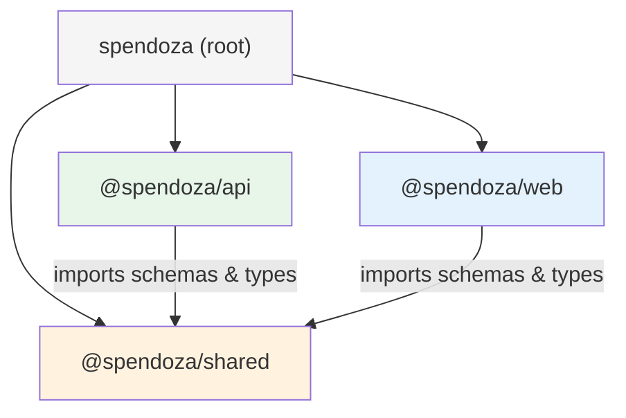
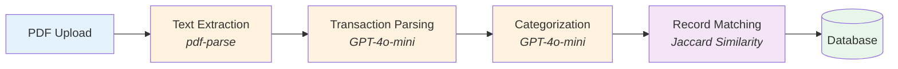
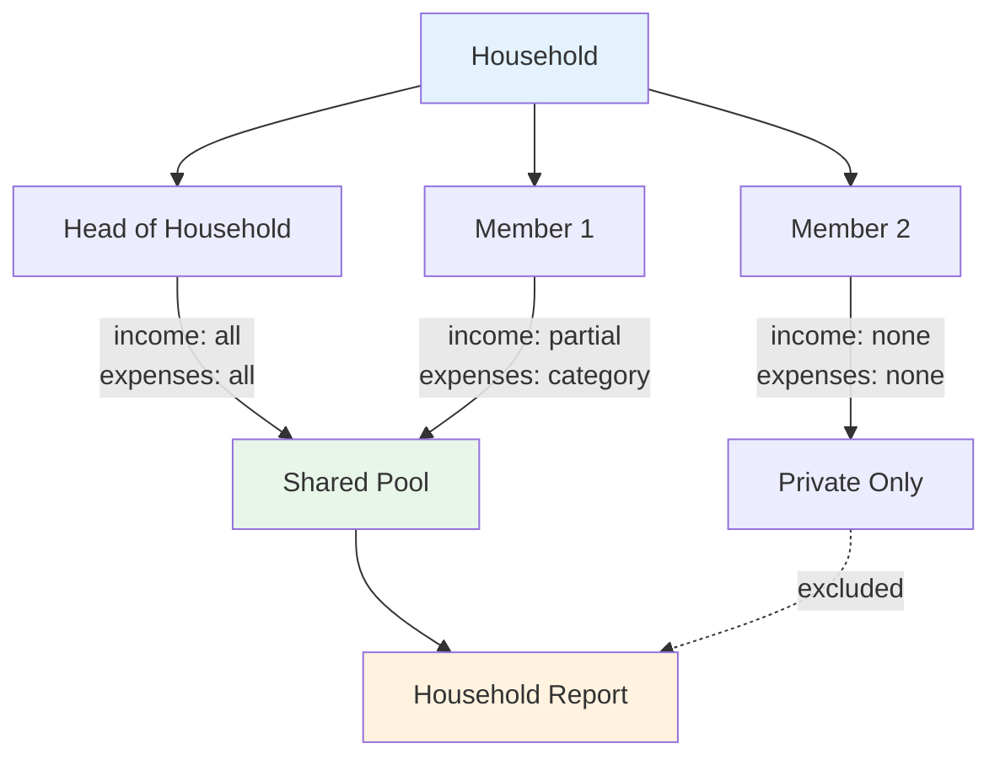
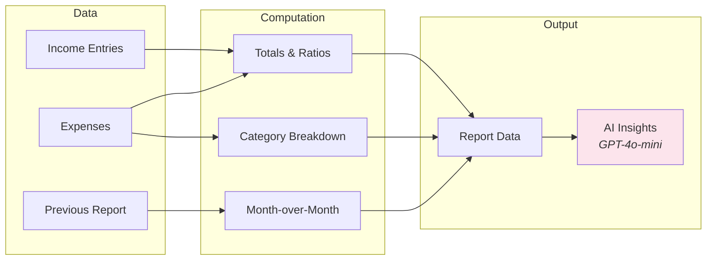
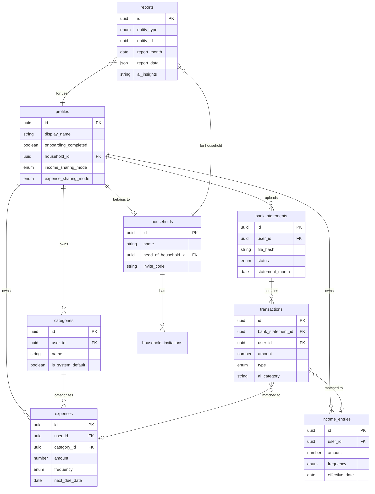
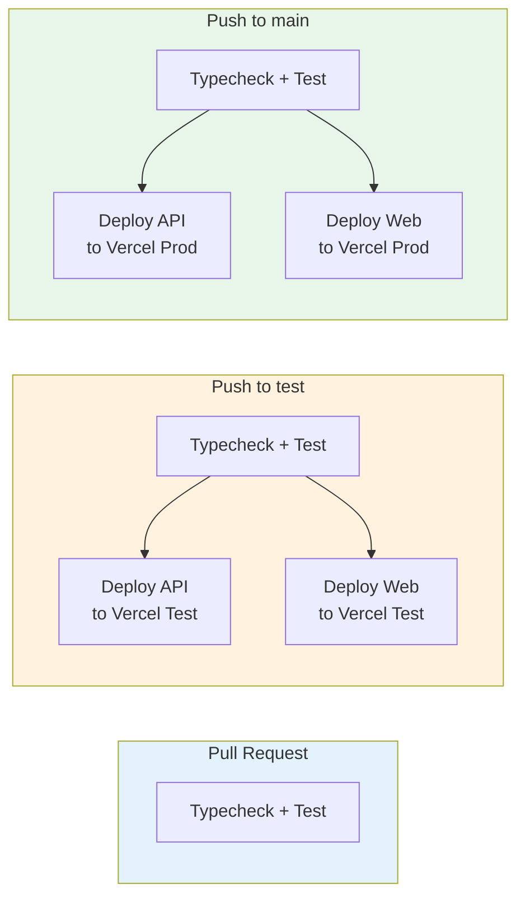

# Spendoza

Personal and household finance tracker with AI-powered bank statement processing, expense categorization, and financial insights.

## Overview

Spendoza helps individuals and households track income, expenses, and savings. Upload a bank statement PDF and the AI pipeline extracts transactions, classifies them into categories, and matches them against existing records. Monthly reports with AI-generated insights keep you informed about your financial health.


## Tech Stack

| Layer | Technology |
|-------|-----------|
| **Runtime** | Bun |
| **Backend** | Express (TypeScript) |
| **Frontend** | React 19, Vite 7 |
| **UI** | shadcn/ui, Tailwind CSS 4, Radix UI |
| **Charts** | Recharts |
| **Data Fetching** | TanStack Query |
| **Validation** | Zod (shared schemas) |
| **AI** | LangChain + OpenAI (GPT-4o-mini) |
| **Database** | Supabase (PostgreSQL + Auth + Storage) |
| **Build** | Turborepo |
| **Deployment** | Vercel |

## Monorepo Structure



```
spendoza/
├── package.json              # Root workspace config
├── turbo.json                # Turborepo task pipeline
├── CLAUDE.md                 # AI assistant instructions
├── .github/workflows/        # CI/CD (PR checks, test deploy, prod deploy)
└── packages/
    ├── shared/               # Zod schemas, types, constants
    │   └── src/schemas/      # 9 schema modules
    ├── api/                  # Express backend
    │   └── src/
    │       ├── routes/       # 10 route modules
    │       ├── services/     # Business logic
    │       ├── ai/           # AI pipeline modules
    │       ├── middleware/    # Auth, validation, error handling
    │       └── lib/          # Supabase client
    └── web/                  # React frontend
        └── src/
            ├── pages/        # 10 page components
            ├── components/   # Feature & UI components
            ├── hooks/        # TanStack Query hooks
            ├── contexts/     # Auth context provider
            └── lib/          # API client, Supabase, utilities
```

## Key Features

### Bank Statement AI Pipeline



Upload a bank statement PDF and the pipeline:
1. Extracts raw text from the PDF
2. Uses GPT-4o-mini to identify individual transactions
3. Classifies each transaction into user-defined categories
4. Matches transactions to existing expenses/income records using string similarity and amount proximity

### Household Finance Sharing



- Create or join a household via invite code
- Each member configures sharing preferences (all, none, partial/category)
- Household reports aggregate shared data only
- Head of household manages invitations and member removal (max 10 members)

### AI-Powered Reports



- Personal and household monthly reports
- Savings rate, expense-to-income ratio, category breakdowns
- Month-over-month trend comparison
- AI-generated bullet-point financial insights
- Rate limited to 2 manual refreshes per month; automated via cron

## Getting Started

### Prerequisites

- [Bun](https://bun.sh) v1.3+
- A [Supabase](https://supabase.com) project (PostgreSQL + Auth + Storage)
- An [OpenAI API key](https://platform.openai.com)

### Installation

```bash
git clone https://github.com/mjmitchell86/Spendoza.git
cd Spendoza
bun install
```

### Environment Variables

Create `.env` files in the relevant packages:

**packages/api/.env**
```env
PORT=3001
SUPABASE_URL=https://your-project.supabase.co
SUPABASE_SERVICE_ROLE_KEY=your-service-role-key
SUPABASE_ANON_KEY=your-anon-key
OPENAI_API_KEY=sk-...
CRON_SECRET=your-cron-secret
```

**packages/web/.env**
```env
VITE_SUPABASE_URL=https://your-project.supabase.co
VITE_SUPABASE_ANON_KEY=your-anon-key
```

### Development

```bash
bun run dev        # Start all packages in dev mode (Turborepo)
bun run build      # Build all packages
bun run test       # Run all tests
bun run typecheck  # Type-check all packages
bun run lint       # Lint all packages
bun run format     # Format with Prettier
```

Per-package development:

```bash
cd packages/api && bun run dev    # API server only (port 3001)
cd packages/web && bun run dev    # Vite dev server only (port 5173)
```

## API Endpoints

| Group | Base Path | Auth | Endpoints |
|-------|-----------|------|-----------|
| Auth | `/api/auth` | Public | signup, login, logout |
| Profile | `/api/profile` | Required | get, update, complete onboarding |
| Categories | `/api/categories` | Required | CRUD |
| Income | `/api/income` | Required | CRUD |
| Expenses | `/api/expenses` | Required | CRUD |
| Bank Statements | `/api/bank-statements` | Required | upload, list, get detail |
| Transactions | `/api/transactions` | Required | list, update, attribute, bulk-attribute |
| Households | `/api/households` | Required | create, get, invite, join, remove, sharing |
| Reports | `/api/reports` | Mixed | personal, household, generate, generate-all (cron) |
| Dashboard | `/api/dashboard` | Required | personal summary, household summary |

## Database Schema



## CI/CD



Three GitHub Actions workflows:
- **PR Check** -- Runs typecheck + test on every pull request
- **Test Deploy** -- On push to `test` branch: checks then deploys both packages to Vercel test environment
- **Prod Deploy** -- On push to `main` branch: checks then deploys to Vercel production

## Git Workflow

1. Create a feature branch from `test`
2. Develop and test locally
3. Push and open a PR against `test` (`gh pr create --base test`)
4. After review, merge to `test` (auto-deploys to test environment)
5. Promote `test` to `main` for production deployment

## Package Documentation

- [`packages/shared/README.md`](packages/shared/README.md) -- Schemas, types, constants, and entity relationships
- [`packages/api/README.md`](packages/api/README.md) -- API endpoints, middleware, AI pipeline, and services
- [`packages/web/README.md`](packages/web/README.md) -- Pages, components, hooks, and data flow
