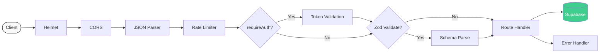
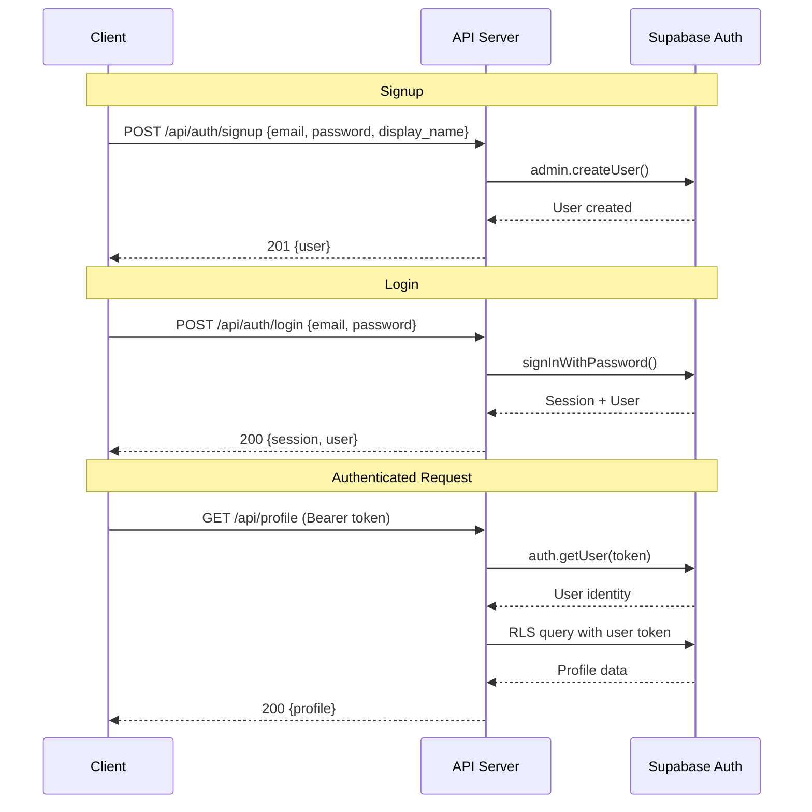
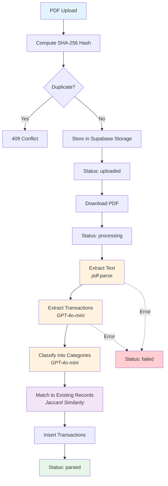
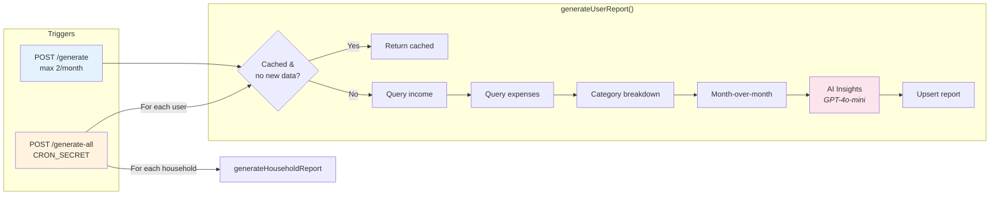

# @spendoza/api

Express + TypeScript backend API for Spendoza. Handles authentication, financial data CRUD, bank statement processing via an AI pipeline, household management, and AI-powered report generation.

## Directory Structure

```
src/
├── index.ts                        # Express app setup, middleware, route mounting
├── lib/
│   └── supabase.ts                 # Supabase admin & RLS client factories
├── middleware/
│   ├── auth.ts                     # JWT token validation (requireAuth)
│   ├── validate.ts                 # Zod request body validation
│   └── error-handler.ts            # Global error handler
├── routes/
│   ├── auth.ts                     # POST /signup, /login, /logout
│   ├── profile.ts                  # GET/PUT profile, PUT /onboarding
│   ├── categories.ts               # CRUD for expense categories
│   ├── income.ts                   # CRUD for income entries
│   ├── expenses.ts                 # CRUD for expenses
│   ├── bank-statements.ts          # Upload, list, get detail
│   ├── transactions.ts             # List, update, attribute, bulk-attribute
│   ├── households.ts               # Create, join, invite, remove, sharing
│   ├── reports.ts                  # Personal/household reports, generate, cron
│   └── dashboard.ts                # Dashboard summaries (personal & household)
├── services/
│   ├── bank-statement.service.ts   # SHA-256 file hashing for dedup
│   ├── household.service.ts        # Invite code generation
│   ├── ai-pipeline.service.ts      # Full PDF-to-transactions pipeline
│   └── report.service.ts           # Report generation (user, household, all)
└── ai/
    ├── pdf-parser.ts               # PDF text extraction + AI transaction parsing
    ├── transaction-classifier.ts   # AI transaction categorization
    ├── expense-matcher.ts          # Deterministic transaction-to-expense matching
    └── report-insights.ts          # AI financial insights generation
```

## Request Lifecycle



## Authentication Flow



## AI Bank Statement Pipeline



### Pipeline Steps

| Step | Module | Method | Description |
|------|--------|--------|-------------|
| 1 | `pdf-parser.ts` | `extractTextFromPDF()` | Extracts raw text from PDF via `pdf-parse` |
| 2 | `pdf-parser.ts` | `extractTransactions()` | GPT-4o-mini extracts structured transactions from text |
| 3 | `transaction-classifier.ts` | `classifyTransactions()` | GPT-4o-mini maps each transaction to a user category (batches of 20) |
| 4 | `expense-matcher.ts` | `matchTransactions()` | Deterministic matching: Jaccard similarity on description + 20% amount tolerance |

## Report Generation



## API Endpoints

### Auth (`/api/auth`) -- No auth required

| Method | Path | Body Schema | Description |
|--------|------|-------------|-------------|
| POST | `/signup` | `signupSchema` | Create user + profile |
| POST | `/login` | `loginSchema` | Sign in, returns session |
| POST | `/logout` | -- | Stateless logout |

### Profile (`/api/profile`) -- Auth required

| Method | Path | Body Schema | Description |
|--------|------|-------------|-------------|
| GET | `/` | -- | Get current user's profile |
| PUT | `/` | `updateProfileSchema` | Update profile fields |
| PUT | `/onboarding` | -- | Mark onboarding complete |

### Categories (`/api/categories`) -- Auth required

| Method | Path | Body Schema | Description |
|--------|------|-------------|-------------|
| GET | `/` | -- | List user's categories |
| POST | `/` | `createCategorySchema` | Create category |
| PUT | `/:id` | `updateCategorySchema` | Update category |
| DELETE | `/:id` | -- | Delete category |

### Income (`/api/income`) -- Auth required

| Method | Path | Body Schema | Description |
|--------|------|-------------|-------------|
| GET | `/` | -- | List income entries |
| POST | `/` | `createIncomeSchema` | Create income entry |
| PUT | `/:id` | `updateIncomeSchema` | Update income entry |
| DELETE | `/:id` | -- | Delete income entry |

### Expenses (`/api/expenses`) -- Auth required

| Method | Path | Body Schema | Description |
|--------|------|-------------|-------------|
| GET | `/` | -- | List expenses |
| POST | `/` | `createExpenseSchema` | Create expense |
| PUT | `/:id` | `updateExpenseSchema` | Update expense |
| DELETE | `/:id` | -- | Delete expense |

### Bank Statements (`/api/bank-statements`) -- Auth required

| Method | Path | Body Schema | Description |
|--------|------|-------------|-------------|
| GET | `/` | -- | List user's statements |
| GET | `/:id` | -- | Get statement + transactions |
| POST | `/upload` | `uploadBankStatementSchema` + file | Upload PDF, triggers AI pipeline |

### Transactions (`/api/transactions`) -- Auth required

| Method | Path | Body Schema | Description |
|--------|------|-------------|-------------|
| GET | `/` | -- | List transactions (with filters) |
| PUT | `/:id` | `updateTransactionSchema` | Update category/matching |
| PUT | `/:id/attribute` | `attributeTransactionSchema` | Attribute to household member |
| POST | `/bulk-attribute` | `bulkAttributeTransactionsSchema` | Batch attribute transactions |

### Households (`/api/households`) -- Auth required

| Method | Path | Body Schema | Description |
|--------|------|-------------|-------------|
| POST | `/` | `createHouseholdSchema` | Create household |
| GET | `/:id` | -- | Get household + members |
| POST | `/:id/invite` | `inviteToHouseholdSchema` | Invite member (head only) |
| POST | `/:id/join` | `joinHouseholdSchema` | Join via invite code |
| DELETE | `/:id/members/:userId` | -- | Remove member (head only) |
| PUT | `/:id/sharing` | `updateSharingSchema` | Update sharing preferences |

### Reports (`/api/reports`) -- Mixed auth

| Method | Path | Auth | Description |
|--------|------|------|-------------|
| GET | `/personal` | requireAuth | Get personal report for month |
| GET | `/household` | requireAuth | Get household report for month |
| POST | `/generate` | requireAuth | Generate personal report (max 2/month) |
| POST | `/generate-all` | CRON_SECRET | Cron: generate all reports |

### Dashboard (`/api/dashboard`) -- Auth required

| Method | Path | Description |
|--------|------|-------------|
| GET | `/personal` | Personal dashboard summary |
| GET | `/household` | Household dashboard summary |

## Rate Limiting

| Scope | Window | Max Requests |
|-------|--------|-------------|
| Global `/api/*` | 15 min | 100 |
| Auth `/api/auth/*` | 15 min | 10 |
| Report generation | Per month | 2 |

## Environment Variables

| Variable | Description |
|----------|-------------|
| `PORT` | Server port (default: 3001) |
| `SUPABASE_URL` | Supabase project URL |
| `SUPABASE_SERVICE_ROLE_KEY` | Supabase admin key (server-side only) |
| `SUPABASE_ANON_KEY` | Supabase anon key (for RLS client) |
| `OPENAI_API_KEY` | OpenAI API key (used by LangChain) |
| `CRON_SECRET` | Bearer token for cron endpoints |
| `NODE_ENV` | `development` / `production` |

## Development

```bash
bun run dev        # Start dev server with hot reload
bun run build      # Compile TypeScript
bun run test       # Run all tests (isolated per file)
bun run typecheck  # Type-check with tsc --noEmit
```

## Testing

Tests use Bun's built-in test runner with `mock.module()` for dependency mocking. Each test file runs in its own Bun process (via `run-tests.sh`) to prevent `mock.module` cross-file contamination.

```
src/
├── routes/__tests__/        # Route-level integration tests (10 files)
├── services/__tests__/      # Service unit tests
├── ai/__tests__/            # AI module unit tests
└── __tests__/integration/   # Multi-endpoint flow tests (4 files)
```
