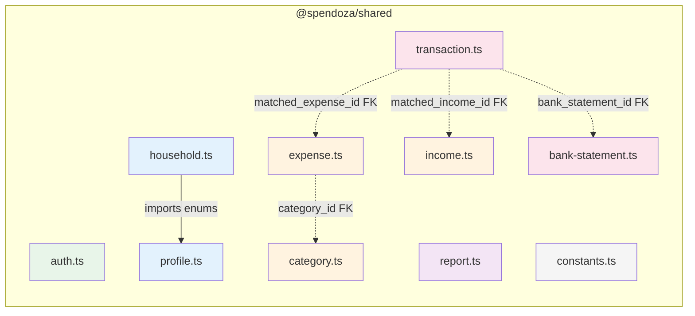
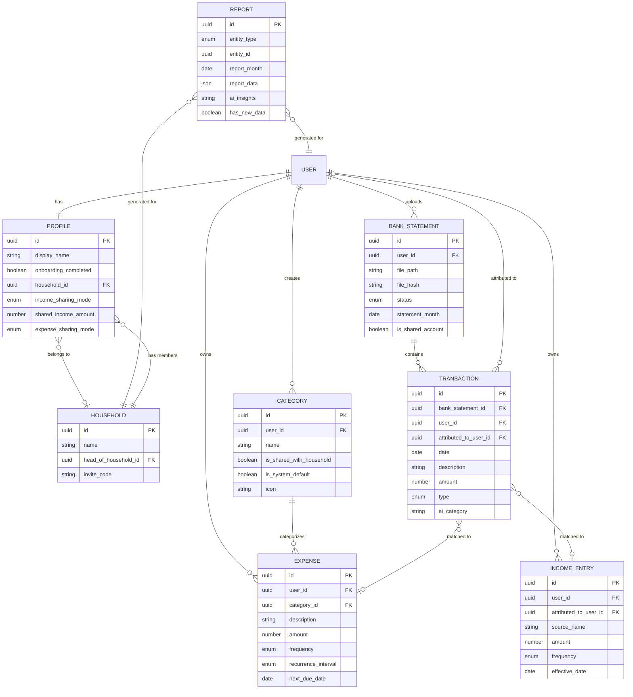

# @spendoza/shared

Shared Zod schemas, TypeScript types, and constants used across the Spendoza monorepo. This package is the single source of truth for validation rules, data models, and application constants consumed by both `@spendoza/api` and `@spendoza/web`.

## Directory Structure

```
src/
├── index.ts              # Main entry — re-exports everything
├── constants.ts          # Global application constants
└── schemas/
    ├── index.ts          # Barrel export for all schemas
    ├── auth.ts           # Signup & login validation
    ├── profile.ts        # User profile & sharing enums
    ├── household.ts      # Household CRUD & invite schemas
    ├── category.ts       # Expense/income categories
    ├── expense.ts        # Expense schemas & enums
    ├── income.ts         # Income entry schemas & enums
    ├── bank-statement.ts # Bank statement upload & status
    ├── transaction.ts    # Parsed transaction schemas
    └── report.ts         # Financial report schemas
```

## Schema Module Map



## Entity Relationship Diagram



## Constants

| Constant | Value | Description |
|----------|-------|-------------|
| `SPENDOZA_VERSION` | `"0.0.1"` | Application version |
| `MAX_HOUSEHOLD_MEMBERS` | `10` | Maximum members per household |
| `MAX_MANUAL_REPORTS_PER_MONTH` | `2` | Rate limit for on-demand report generation |
| `MAX_BANK_STATEMENT_SIZE_MB` | `10` | Max upload file size |
| `SYSTEM_CATEGORIES` | 13 items | Default categories: Housing, Utilities, Groceries, Transportation, Healthcare, Insurance, Entertainment, Dining Out, Personal, Savings, Debt Payments, Subscriptions, Other |

## Schemas Reference

### Request Validation Schemas

These Zod schemas validate incoming API request bodies. Each exports an inferred TypeScript type.

| Schema | Purpose | Key Validations |
|--------|---------|-----------------|
| `signupSchema` | User registration | email (valid format), password (min 8 chars), display_name (1-100) |
| `loginSchema` | User login | email (valid format), password (required) |
| `updateProfileSchema` | Edit profile | All fields optional; display_name (1-100), sharing enums |
| `createHouseholdSchema` | Create household | name (1-100 chars) |
| `inviteToHouseholdSchema` | Invite member | email (valid format) |
| `joinHouseholdSchema` | Join via code | invite_code (required) |
| `updateSharingSchema` | Set sharing prefs | income_sharing_mode, expense_sharing_mode, shared_income_amount |
| `createCategorySchema` | New category | name (1-100), icon (optional), is_shared_with_household (default false) |
| `updateCategorySchema` | Edit category | Partial of create schema |
| `createExpenseSchema` | New expense | category_id (uuid), description (1-500), amount (positive), frequency, next_due_date |
| `updateExpenseSchema` | Edit expense | Partial of create schema |
| `createIncomeSchema` | New income | source_name (1-200), amount (positive), frequency, effective_date |
| `updateIncomeSchema` | Edit income | Partial of create schema |
| `uploadBankStatementSchema` | Upload statement | statement_month (required), bank_name, is_shared_account, account_label |
| `updateTransactionSchema` | Edit transaction | ai_category, matched_expense_id, matched_income_id |
| `attributeTransactionSchema` | Attribute txn | attributed_to_user_id (uuid, required) |
| `bulkAttributeTransactionsSchema` | Batch attribute | Array of { transaction_id, attributed_to_user_id } |

### Enum Types

| Enum | Values | Used By |
|------|--------|---------|
| `IncomeSharingMode` | `all` · `none` · `partial` | Profile, Household |
| `ExpenseSharingMode` | `all` · `none` · `category` | Profile, Household |
| `ExpenseFrequency` | `one_time` · `recurring` | Expense |
| `RecurrenceInterval` | `weekly` · `biweekly` · `monthly` · `quarterly` · `annually` | Expense |
| `Frequency` | `one_time` · `weekly` · `biweekly` · `monthly` · `annually` | Income |
| `StatementStatus` | `uploaded` · `processing` · `parsed` · `failed` | BankStatement |
| `TransactionType` | `credit` · `debit` | Transaction |
| `EntityType` | `user` · `household` | Report |

### Data Model Interfaces

Each module exports a TypeScript interface representing its database row shape: `Profile`, `Household`, `HouseholdMember`, `Category`, `Expense`, `IncomeEntry`, `BankStatement`, `Transaction`, `Report`.

## Usage

```typescript
import {
  signupSchema,
  type SignupInput,
  type Profile,
  SYSTEM_CATEGORIES,
  MAX_HOUSEHOLD_MEMBERS,
} from "@spendoza/shared";

// Validate API input
const result = signupSchema.safeParse(req.body);
if (!result.success) {
  return res.status(400).json({ error: "Validation failed" });
}

// Use type-safe data
const input: SignupInput = result.data;
```

## Development

```bash
bun run typecheck   # Type-check with tsc --noEmit
```
