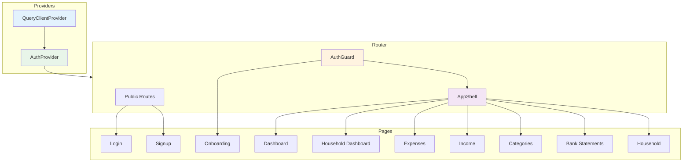
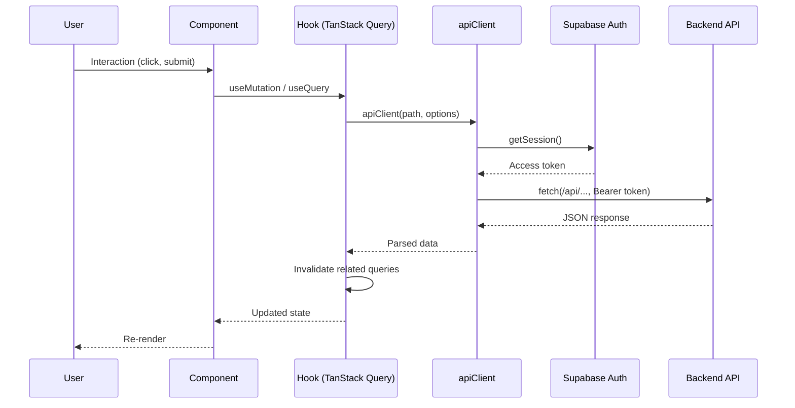
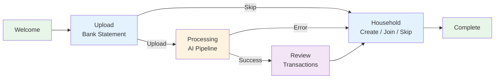

# @spendoza/web

React + Vite frontend for Spendoza. Provides a dashboard-driven UI for personal and household finance tracking with AI-powered insights, bank statement processing, and Recharts visualizations.

## Directory Structure

```
src/
├── main.tsx                             # React root mount
├── App.tsx                              # Router + providers setup
├── index.css                            # Tailwind CSS entry
├── lib/
│   ├── supabase.ts                      # Supabase browser client
│   ├── api.ts                           # Authenticated fetch wrapper
│   └── utils.ts                         # cn() classname utility
├── contexts/
│   └── auth-context.tsx                 # Auth state provider (Supabase)
├── hooks/
│   ├── use-auth.ts                      # useAuth() context hook
│   ├── use-dashboard.ts                 # Dashboard & report generation queries
│   ├── use-expenses.ts                  # Expense CRUD mutations
│   ├── use-income.ts                    # Income CRUD mutations
│   ├── use-categories.ts               # Category CRUD mutations
│   ├── use-bank-statements.ts           # Statement upload & transaction queries
│   └── use-household.ts                 # Household management mutations
├── pages/
│   ├── login.tsx                        # Login form
│   ├── signup.tsx                       # Signup form
│   ├── onboarding.tsx                   # 6-step onboarding wizard
│   ├── dashboard.tsx                    # Personal financial dashboard
│   ├── household-dashboard.tsx          # Household financial dashboard
│   ├── expenses.tsx                     # Expense management
│   ├── income.tsx                       # Income management
│   ├── categories.tsx                   # Category management
│   ├── bank-statements.tsx              # Bank statement upload & review
│   └── household.tsx                    # Household settings & members
└── components/
    ├── auth-guard.tsx                   # Route protection (redirects to login)
    ├── layout/
    │   ├── app-shell.tsx                # Main layout wrapper (sidebar + content)
    │   ├── header.tsx                   # Top navigation bar
    │   └── sidebar.tsx                  # Side navigation menu
    ├── dashboard/
    │   ├── income-vs-expenses-chart.tsx  # Recharts bar chart
    │   ├── spending-by-category-chart.tsx # Recharts pie chart
    │   ├── savings-rate-card.tsx         # Savings rate gauge
    │   ├── top-expenses-list.tsx         # Top spending categories
    │   ├── upcoming-bills-list.tsx       # Recurring expense calendar
    │   └── ai-insights-card.tsx          # AI-generated insights display
    ├── expenses/
    │   ├── expense-form.tsx             # Create/edit expense dialog
    │   └── expense-list.tsx             # Expense table with actions
    ├── income/
    │   ├── income-form.tsx              # Create/edit income dialog
    │   └── income-list.tsx              # Income table with actions
    ├── categories/
    │   └── category-form.tsx            # Create/edit category dialog
    ├── bank-statements/
    │   ├── upload-form.tsx              # PDF/CSV upload form
    │   ├── statement-list.tsx           # Statement history table
    │   └── transaction-review.tsx       # Review parsed transactions
    ├── household/
    │   ├── create-household.tsx         # Create household form
    │   ├── join-household.tsx           # Join via invite code
    │   ├── invite-form.tsx              # Email invite form
    │   ├── member-list.tsx              # Member list with remove action
    │   └── sharing-config.tsx           # Income/expense sharing settings
    ├── onboarding/
    │   ├── welcome-step.tsx             # Welcome introduction
    │   ├── upload-step.tsx              # First bank statement upload
    │   ├── processing-step.tsx          # AI processing progress
    │   ├── review-step.tsx              # Review extracted transactions
    │   ├── household-step.tsx           # Create/join household
    │   └── complete-step.tsx            # Completion confirmation
    └── ui/                              # shadcn/ui primitives
        ├── avatar.tsx
        ├── badge.tsx
        ├── button.tsx
        ├── card.tsx
        ├── dialog.tsx
        ├── dropdown-menu.tsx
        ├── input.tsx
        ├── label.tsx
        ├── progress.tsx
        ├── select.tsx
        ├── separator.tsx
        ├── sheet.tsx
        ├── sonner.tsx
        ├── switch.tsx
        ├── table.tsx
        ├── tabs.tsx
        └── textarea.tsx
```

## Application Architecture



## Data Flow



## Routing

| Path | Page | Auth | Layout |
|------|------|------|--------|
| `/login` | LoginPage | Public | None |
| `/signup` | SignupPage | Public | None |
| `/onboarding` | OnboardingPage | Required | None (fullscreen) |
| `/dashboard` | DashboardPage | Required | AppShell |
| `/expenses` | ExpensesPage | Required | AppShell |
| `/income` | IncomePage | Required | AppShell |
| `/categories` | CategoriesPage | Required | AppShell |
| `/bank-statements` | BankStatementsPage | Required | AppShell |
| `/household` | HouseholdPage | Required | AppShell |
| `/household-dashboard` | HouseholdDashboardPage | Required | AppShell |
| `/` | Redirects to `/dashboard` | -- | -- |

## Onboarding Flow



## Hooks Reference

### Dashboard

| Hook | Type | Query Key | Description |
|------|------|-----------|-------------|
| `usePersonalDashboard` | Query | `["dashboard", "personal"]` | Fetch personal dashboard summary |
| `useHouseholdDashboard` | Query | `["dashboard", "household"]` | Fetch household dashboard summary |
| `useGenerateReport` | Mutation | Invalidates `dashboard` | Trigger on-demand report generation |

### Expenses

| Hook | Type | Query Key | Description |
|------|------|-----------|-------------|
| `useExpenses` | Query | `["expenses"]` | List all expenses |
| `useCreateExpense` | Mutation | Invalidates `expenses` | Create expense |
| `useUpdateExpense` | Mutation | Invalidates `expenses` | Update expense by ID |
| `useDeleteExpense` | Mutation | Invalidates `expenses` | Delete expense by ID |

### Income

| Hook | Type | Query Key | Description |
|------|------|-----------|-------------|
| `useIncome` | Query | `["income"]` | List all income entries |
| `useCreateIncome` | Mutation | Invalidates `income` | Create income entry |
| `useUpdateIncome` | Mutation | Invalidates `income` | Update income entry |
| `useDeleteIncome` | Mutation | Invalidates `income` | Delete income entry |

### Categories

| Hook | Type | Query Key | Description |
|------|------|-----------|-------------|
| `useCategories` | Query | `["categories"]` | List all categories |
| `useCreateCategory` | Mutation | Invalidates `categories` | Create category |
| `useUpdateCategory` | Mutation | Invalidates `categories` | Update category |
| `useDeleteCategory` | Mutation | Invalidates `categories` | Delete category |

### Bank Statements

| Hook | Type | Query Key | Description |
|------|------|-----------|-------------|
| `useBankStatements` | Query | `["bank-statements"]` | List all statements |
| `useBankStatement` | Query | `["bank-statements", id]` | Get single statement |
| `useTransactions` | Query | `["transactions", id]` | Get transactions for statement |
| `useUploadBankStatement` | Mutation | Invalidates `bank-statements` | Upload PDF or CSV (FormData) |
| `useUpdateTransaction` | Mutation | Invalidates `transactions` | Update transaction |
| `useBulkAttributeTransactions` | Mutation | Invalidates `transactions` | Batch attribute |

### Household

| Hook | Type | Query Key | Description |
|------|------|-----------|-------------|
| `useHousehold` | Query | `["household"]` | Get household + members |
| `useCreateHousehold` | Mutation | Invalidates `household` | Create household |
| `useJoinHousehold` | Mutation | Invalidates `household` | Join via invite code |
| `useInviteToHousehold` | Mutation | Invalidates `household` | Invite member by email |
| `useUpdateSharing` | Mutation | Invalidates `household` | Update sharing prefs |
| `useRemoveMember` | Mutation | Invalidates `household` | Remove household member |
| `useLeaveHousehold` | Mutation | Invalidates `household` | Leave household |

## Key Dependencies

| Package | Purpose |
|---------|---------|
| `react` + `react-dom` | UI framework |
| `react-router-dom` | Client-side routing |
| `@tanstack/react-query` | Server state management + caching |
| `@supabase/supabase-js` | Auth session management |
| `recharts` | Dashboard charts (bar, pie) |
| `tailwindcss` | Utility-first CSS |
| `radix-ui` | Accessible headless UI primitives |
| `class-variance-authority` | Component variant styling |
| `lucide-react` | Icon library |
| `sonner` | Toast notifications |

## Environment Variables

| Variable | Description |
|----------|-------------|
| `VITE_SUPABASE_URL` | Supabase project URL |
| `VITE_SUPABASE_ANON_KEY` | Supabase anonymous/public key |

## Development

```bash
bun run dev        # Start Vite dev server (port 5173)
bun run build      # Type-check + production build
bun run typecheck  # Type-check only
bun run lint       # ESLint
bun run preview    # Preview production build
```
